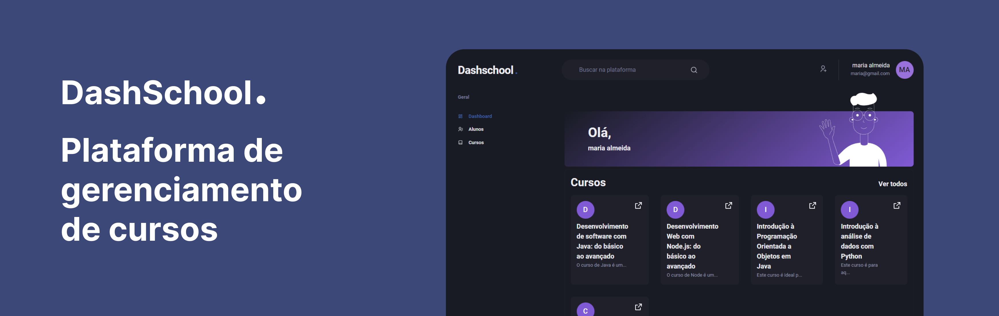

  

<h2 align="center">DashSchool Gerenciador de Cursos</h1>

Este é um projeto de gerenciador de cursos desenvolvido com Next.js e Prisma, usando o framework Chakra UI para estilização.

____
## Funcionalidades

Com este aplicativo, você pode:

-   Criar um curso
-   Editar um curso
-   Excluir um curso
-   Adicionar um aluno a um curso
-   Remover um aluno de um curso
-   Listar todos os cursos
-   Ver detalhes de um curso, incluindo a lista de alunos matriculados

___
## Stacks utilizadas

Este projeto utiliza as seguintes stacks:

-   Next.js
-   Prisma
-   Chakra UI

_____

## Screenshots

Algumas screenshots da sua aplicação abaixo:

___
## Instalação

Para executar este aplicativo localmente, siga estas etapas: